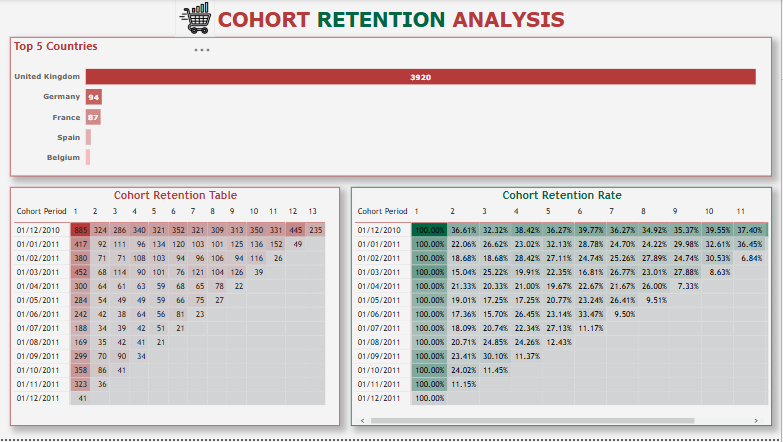
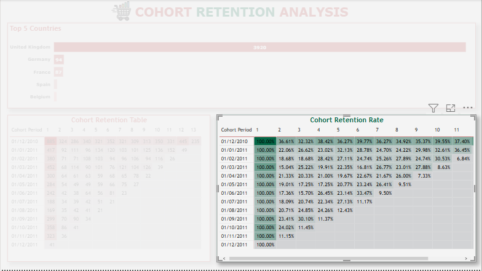
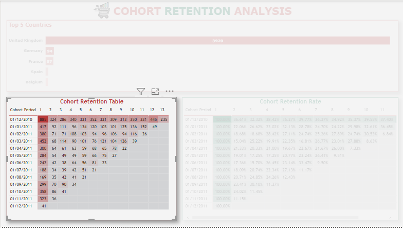
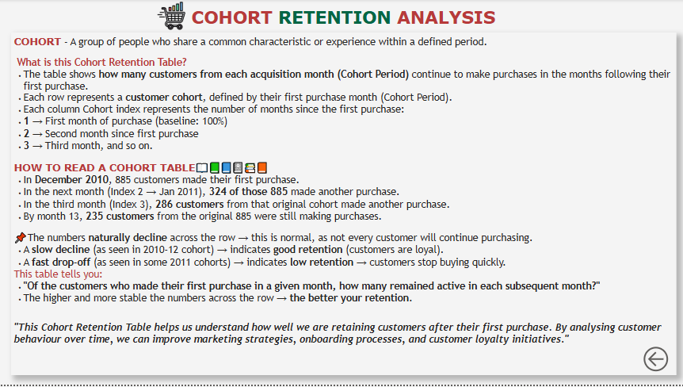

# Cohort Retention Analysis

This project focuses on conducting a **Cohort Retention Analysis** to understand customer behavior over time, using the *Online Retail* dataset. The analysis was performed using **SQL** for data cleaning and preparation, and visualized using **Power BI**.

---

## 📊 Project Files

| File / Folder                       | Description                                          |
|-------------------------------------|------------------------------------------------------|
| `Online Retail`                     | Original dataset used for the project                |
| `Cohort Retention Analysis.sql`     | SQL script used to clean data and create cohort table |
| `Cohort Retention.csv`              | Cleaned dataset exported from SQL for visualization  |
| `COHORT RETENTION DASHBOARD.pbix`   | Power BI dashboard file                              |
| `COHORT RETENTION DASHBOARD.png`    | Full screenshot of the Power BI dashboard            |
| `COHORT RETENTION RATE.png`         | Cohort Retention matrix in %                         |
| `COHORT RETENTION TABLE.png`        | Cohort Retention matrix (counts)                     |
| `Dashboard info.png`                | Info about the dashboard included in Power BI        |

---

## 📌 Project Objectives

- Understand customer purchasing behavior over time.
- Analyze retention rates across different customer cohorts.
- Visualize patterns and trends to support business decision-making.
- Build a **Cohort Retention Dashboard** for interactive insights.

---

## 🗂 Methodology

### 1️⃣ Data Cleaning and Preparation

- The dataset was first cleaned using **SQL**:
    - Removed invalid records (null CustomerID, negative quantity/price).
    - Deduplicated transactions.
    - Created a **Cohort Date** based on each customer's first purchase.
    - Created a **Cohort Index** to track retention by months since first purchase.

- Final cleaned dataset was exported to `Cohort Retention.csv` for visualization.

### 2️⃣ Cohort Analysis Logic

- **Cohort Date** = The month of first purchase per customer.
- **Cohort Index** = Number of months since first purchase.
- The retention matrix was built showing how many customers remained active over each cohort period.

### 3️⃣ Visualization in Power BI

- Built an **interactive dashboard** using:
    - Cohort Retention Table (Counts)
    - Cohort Retention Rate Matrix (% Retention)
    - Supporting visuals + Info panel

---

## 🖼️ Dashboard Preview
[`Link to COHORT DASHBOARD`](https://app.powerbi.com/groups/me/reports/3ff024d6-bb51-455e-a68f-e7153090ea4c?ctid=319a61c8-ee1e-4161-8f35-b9553227afd7&pbi_source=linkShare)

### Full Dashboard

### Cohort Retention Rate (Matrix in %)

### Cohort Retention Table (Counts)

### Dashboard Info Panel

---

## 📈 Insights & Findings

- The **retention rate** typically drops sharply after the first month.
- Only a small percentage of customers are retained after month 3 or 4.
- Certain **cohorts performed better**, suggesting opportunities to investigate what drove those higher retention rates.
- The company can use these insights to:
    - Improve customer onboarding experience.
    - Design targeted campaigns to boost early retention.
    - Focus on cohorts with better lifetime value.

---

## 🚀 Tools Used

- **SQL Server** (MS SQL) — Data cleaning & cohort table creation
- **Power BI** — Data visualization & dashboard creation
- **Excel** — Supporting analysis and data export/import

---

## 📚 What is a Cohort?

> A **cohort** is a group of users who share a common characteristic within a defined time period.  
In this case, cohorts are defined based on each customer's **first purchase month**.

**Cohort Retention Analysis** helps to analyze:
- How long customers stay engaged.
- The effectiveness of customer acquisition strategies.
- Patterns in customer lifecycle.

---

## 🤝 Acknowledgements

This project was completed as part of my Data Analysis portfolio, applying cohort analysis techniques using SQL and Power BI.

---

## 💬 Contact

For any questions or feedback, feel free to connect!

---

