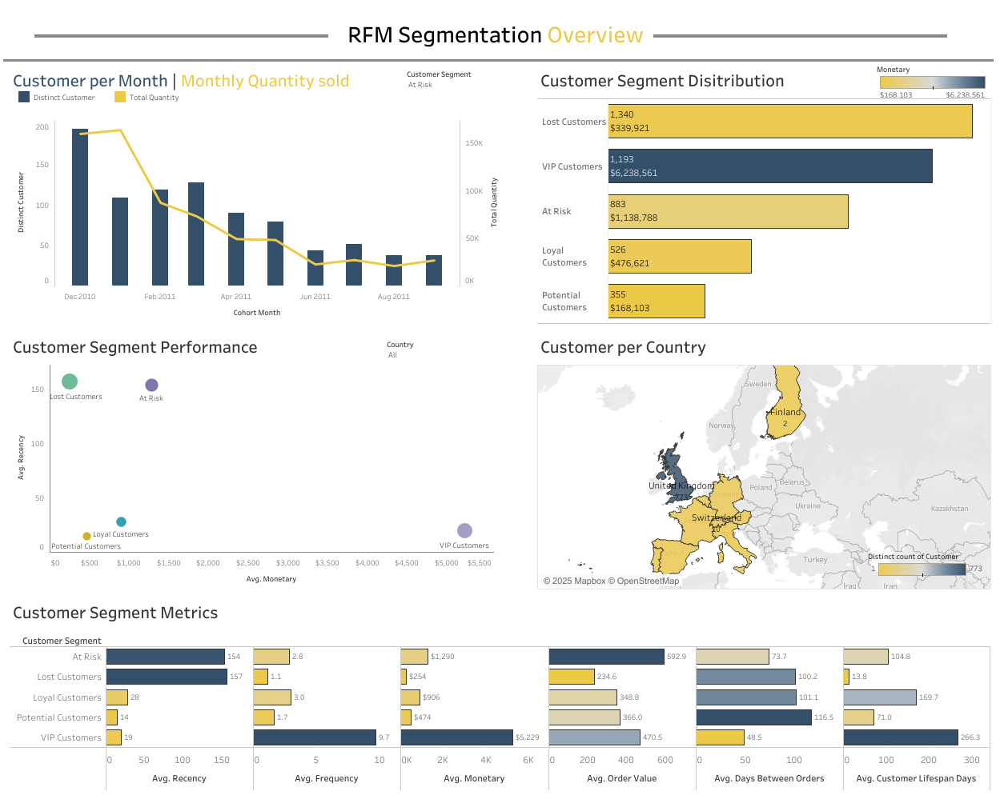
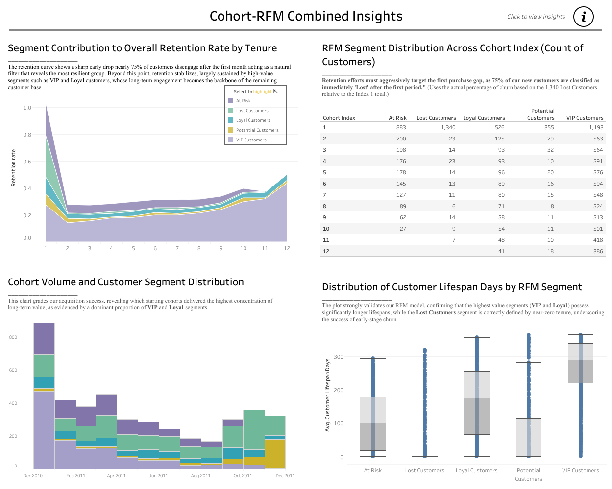

# Cohort Retention Analysis

This project focuses on conducting a **Cohort Retention Analysis** to understand customer behavior over time, using the *Online Retail* dataset. The analysis was performed using **SQL** for data cleaning and preparation, and visualized using **Tableau**.

---

## 📌 Project Objectives

- Understand customer purchasing behavior over time.
- Categorize your custommers based on their purchases behaviour (RFM Analysis)
- Analyze retention rates across different customer cohorts.
- Visualize patterns and trends to support business decision-making.
- Build a **Cohort Retention | RFM Analysis Dashboard** for interactive insights.

---

## 🗂 Methodology

### 1️⃣ Data Cleaning and Preparation

- The dataset was first cleaned using **SQL**:
    - Removed invalid records (null CustomerID, negative quantity/price).
    ```sql
    -- Filter out NULL CustomerIDs and add Revenue
    SELECT 
    InvoiceNo,
    StockCode,
    [Description],
    Quantity,
    InvoiceDate,
    UnitPrice,
    CustomerID,
    Country,
    (Quantity * UnitPrice) AS Revenue
    INTO #Filtered_Retail
    FROM Online_Retail
    WHERE CustomerID IS NOT NULL;
    ```
    ```sql
    -- Keep only valid transactions
    SELECT *
    INTO #Valid_Transactions
    FROM #Filtered_Retail
    WHERE Quantity > 0 AND UnitPrice > 0;
    ```
    - Remove duplicated transactions.
    ```sql
    SELECT *,
       ROW_NUMBER() OVER (PARTITION BY InvoiceNo, StockCode, Quantity ORDER BY InvoiceDate) AS row_num
    INTO #Duplicate_Transactions
    FROM #Valid_Transactions;
    ```
    ```sql
    SELECT  
    InvoiceNo,
    StockCode,
    [Description],
    Quantity,
    InvoiceDate,
    UnitPrice,
    CustomerID,
    Country,
    Revenue
    INTO Online_Retail_Main
    FROM #Duplicate_Transactions
    WHERE row_num = 1;
    ```
### 2️⃣ COHORT ANALYSIS
    ```sql
    -- =========================================
    -- 1: IDENTIFY CUSTOMER COHORTS
    -- =========================================
    SELECT 
        CustomerID,
        MIN(InvoiceDate) AS FirstPurchaseDate,
        DATEFROMPARTS(YEAR(MIN(InvoiceDate)), MONTH(MIN(InvoiceDate)), 1) AS CohortDate
    INTO #CustomerCohort
    FROM Online_Retail_Main 
    GROUP BY CustomerID;
    
    SELECT *
    FROM #CustomerCohort;
    ```
    ```sql
    -- =========================================
    -- 2: BUILD COHORT INDEX (MONTH DIFFERENCE)
    -- =========================================
    DROP TABLE IF EXISTS Cohort_Retention;
    
    SELECT 
        m.*,
        c.CohortDate,
        YEAR(m.InvoiceDate) AS Invoice_Year,
        MONTH(m.InvoiceDate) AS Invoice_Month,
        YEAR(c.CohortDate) AS Cohort_Year,
        MONTH(c.CohortDate) AS Cohort_Month,
        (YEAR(m.InvoiceDate) - YEAR(c.CohortDate)) * 12 +
        (MONTH(m.InvoiceDate) - MONTH(c.CohortDate)) + 1 AS Cohort_Index
    INTO Cohort_Retention
    FROM Online_Retail_Main m
    LEFT JOIN #CustomerCohort c 
        ON m.CustomerID = c.CustomerID
    WHERE NOT (YEAR(m.InvoiceDate) = 2011 AND MONTH(m.InvoiceDate) = 12);
    
    
    SELECT MAX(InvoiceDate)
    FROM Cohort_Retention;
    
    SELECT *
    FROM Cohort_Retention;
    ```
    ```sql
    -- =========================================
    -- 3: PIVOT COHORT DATA (RETENTION COUNT)
    -- =========================================
    SELECT *
    INTO #CohortCounts
    FROM (
        SELECT CohortDate, Cohort_Index, CustomerID
        FROM Cohort_Retention
        GROUP BY CohortDate, Cohort_Index, CustomerID
    ) base
    PIVOT (
        COUNT(CustomerID)
        FOR Cohort_Index IN ([1],[2],[3],[4],[5],[6],[7],[8],[9],[10],[11],[12])
    ) AS PivotedCohort;
    
    SELECT *
    FROM #CohortCounts
    ORDER BY CohortDate;
    ```
    ```sql
    -- =========================================
    -- 5: REVENUE ANALYSIS BY COHORT
    -- =========================================
    SELECT 
        CohortDate,
        Cohort_Index,
        SUM(Revenue) AS TotalRevenue,
        COUNT(DISTINCT CustomerID) AS Active_Customers
    FROM Cohort_Retention
    GROUP BY CohortDate, Cohort_Index
    ORDER BY CohortDate, Cohort_Index;
    ```
- Final Cohort dataset was exported [Cohort Retention](./Cohort_Retention.rar) for visualization.

### 3️⃣ RFM Segmentation
    ```sql
    DECLARE @analysis_date DATE;

    SELECT @analysis_date = MAX(InvoiceDate) 
    FROM Cohort_Retention;
    
    -- Drop existing table if re-running
    IF OBJECT_ID('dbo.RFM_Segments_Final','U') IS NOT NULL
        DROP TABLE dbo.RFM_Segments_Final;
    
    -- ============================================================
    -- Calculate base RFM metrics
    -- ============================================================
    WITH CustomerRFM AS (
        SELECT 
            CustomerID,
            DATEDIFF(DAY, MAX(InvoiceDate), @analysis_date) AS Recency,
            COUNT(DISTINCT InvoiceNo) AS Frequency,
            SUM(Revenue) AS Monetary,
            MIN(InvoiceDate) AS FirstPurchaseDate,
            MAX(InvoiceDate) AS LastPurchaseDate,
            DATEDIFF(DAY, MIN(InvoiceDate), MAX(InvoiceDate)) + 1 AS CustomerLifespanDays,
            COUNT(DISTINCT StockCode) AS UniqueProducts,
            SUM(Quantity) AS TotalQuantity,
            MIN(CohortDate) AS CohortDate,
            MIN(Cohort_Year) AS Cohort_Year,
            MIN(Cohort_Month) AS Cohort_Month       
        FROM Cohort_Retention
        WHERE CustomerID IS NOT NULL
          AND Quantity > 0
          AND Revenue > 0
        GROUP BY CustomerID
    ),
    
    -- ============================================================
    -- Calculate RFM quintile scores
    -- ============================================================
    RFM_Scores AS (
        SELECT 
            *,
            -- R: lower recency = better → invert score
            6 - NTILE(5) OVER (ORDER BY Recency ASC) AS R_Score,
            -- F: higher frequency = better
            NTILE(5) OVER (ORDER BY Frequency ASC) AS F_Score,
            -- M: higher spending = better
            NTILE(5) OVER (ORDER BY Monetary ASC) AS M_Score
        FROM CustomerRFM
    ),
    
    -- ============================================================
    -- Add derived metrics
    -- ============================================================
    RFM_Enhanced AS (
        SELECT 
            *,
            (R_Score + F_Score + M_Score) AS RFM_Score,
            CAST(R_Score AS VARCHAR(1)) + 
            CAST(F_Score AS VARCHAR(1)) + 
            CAST(M_Score AS VARCHAR(1)) AS RFM_Cell,
            CAST(Monetary / NULLIF(Frequency, 0) AS DECIMAL(12,2)) AS AvgOrderValue,
            CAST(Frequency * 1.0 / NULLIF(CustomerLifespanDays, 0) AS DECIMAL(12,6)) AS PurchaseFrequency,
            CASE WHEN Frequency > 1 
                 THEN CAST(CustomerLifespanDays * 1.0 / NULLIF(Frequency - 1, 0) AS DECIMAL(12,2)) 
                 ELSE NULL END AS AvgDaysBetweenOrders
        FROM RFM_Scores
    ),
    
    -- ============================================================
    -- Assign segments & actions
    -- ============================================================
    Customer_Segments AS (
        SELECT 
            *,
            CASE 
                WHEN M_Score >= 4 AND F_Score >= 4 AND R_Score >= 3 THEN 'VIP Customers'
                WHEN F_Score >= 3 AND M_Score >= 3 AND R_Score >= 3 THEN 'Loyal Customers'
                WHEN (R_Score >= 4 AND (F_Score >= 2 OR M_Score >= 3)) 
                     OR (M_Score >= 4 AND R_Score >= 3) THEN 'Potential Customers'
                WHEN (M_Score >= 3 OR F_Score >= 3) AND R_Score <= 2 THEN 'At Risk'
                ELSE 'Lost Customers'
            END AS Customer_Segment,
    FROM RFM_Enhanced
    )
    
    -- ============================================================
    -- Save to final table
    -- ============================================================
    SELECT * 
    INTO dbo.RFM_Segments_Final
    FROM Customer_Segments;
    
    SELECT *
    FROM RFM_Segments_Final;
    ```
    ```sql
    -- ============================================================
    -- SUMMARY STATISTICS BY SEGMENT
    -- ============================================================
    WITH SegmentStats AS (
        SELECT 
            Customer_Segment,
            Action_Priority,

        -- Base counts and revenue
        COUNT(*) AS CustomerCount,
        SUM(Monetary) AS TotalRevenue,
        AVG(Monetary) AS AvgRevenue,

        -- Behavior metrics
        AVG(Recency) AS AvgDaysSinceLastPurchase,
        AVG(Frequency) AS AvgOrders,
        AVG(AvgOrderValue) AS AvgOrderValue,

        -- RFM scores
        AVG(CAST(R_Score AS FLOAT)) AS AvgRecencyScore,
        AVG(CAST(F_Score AS FLOAT)) AS AvgFrequencyScore,
        AVG(CAST(M_Score AS FLOAT)) AS AvgMonetaryScore
    FROM RFM_Segments_Final
    GROUP BY Customer_Segment, Action_Priority
    )
    SELECT 
        Customer_Segment,
        Action_Priority,
        CustomerCount,
        CAST(CustomerCount * 100.0 / SUM(CustomerCount) OVER() AS DECIMAL(5,2)) AS CustomerPercent,
        TotalRevenue,
        CAST(TotalRevenue * 100.0 / SUM(TotalRevenue) OVER() AS DECIMAL(5,2)) AS RevenuePercent,
        AvgRevenue,
        AvgDaysSinceLastPurchase,
        AvgOrders,
        AvgOrderValue,
        AvgRecencyScore,
        AvgFrequencyScore,
        AvgMonetaryScore
    FROM SegmentStats
    ORDER BY Action_Priority, TotalRevenue DESC;
    ```
    ```sql
    -- ============================================================
    -- CUSTOMER SEGMENT DISTRIBUTION BY COHORT
    -- ============================================================
    SELECT 
        Cohort_Year,
        Cohort_Month,
        Customer_Segment,
        COUNT(*) AS Customers,
        AVG(Monetary) AS AvgRevenue,
        SUM(Monetary) AS TotalRevenue
    FROM RFM_Segments_Final
    GROUP BY Cohort_Year, Cohort_Month, Customer_Segment
    ORDER BY Cohort_Year, Cohort_Month, 
        CASE Customer_Segment
            WHEN 'VIP Customers' THEN 1
            WHEN 'Loyal Customers' THEN 2
            WHEN 'Potential Customers' THEN 3
            WHEN 'At Risk' THEN 4
            WHEN 'Lost Customers' THEN 5
        END;
    ```
  
- Final RFM dataset was exported to [RFM_Segment](./RFM_Segment.csv) for visualization.

---

## 🖼️ Dashboard Preview
[`Link to COHORT | RFM DASHBOARD`](https://public.tableau.com/views/Cohort-RFMcombineddashboard/cohort-RFM?:language=en-US&:sid=&:redirect=auth&:display_count=n&:origin=viz_share_link)

### Cohort Retention Overview
#### This dashboard visualizes the lifecycle of customer engagement, highlighting a significant challenge in retaining customers after their initial interaction. The "Cohort Retention Rate" heatmap reveals a sharp drop-off, where retention across most cohorts falls below 30% immediately after the first month, suggesting that a large portion of customers do not return for a second purchase. While the December 2010 cohort is a notable outlier—generating the highest revenue ($570k in month 1) and maintaining strong retention (50% by month 12)—subsequent cohorts from 2011 show weaker acquisition numbers and faster churn rates, indicating a potential decline in marketing efficiency or product stickiness over time.


### RFM Segmentation
- This analysis categorizes customers based on value and behavior, revealing a heavy reliance on a specific high-value group. The "Customer Segment Distribution" shows that while "Lost Customers" are the most numerous group (1,340), they contribute very little financial value ($339k); conversely, "VIP Customers" generate the vast majority of total revenue ($6.2M) despite being fewer in number. The "Customer Segment Metrics" further illustrate that VIPs have a significantly higher average frequency (9.7 purchases) and average lifespan compared to the "At Risk" and "Lost" segments, confirming that the business model is currently sustained by deep engagement with a core group of power users rather than broad-based retention.
  


### COMBINED cohort | RFM Dashboard
- This dashboard merges the previous two analyses to explain why the retention rates drop so sharply. The "Segment Contribution to Overall Retention Rate" area chart demonstrates that the steep drop after month one is caused almost entirely by the "Lost Customers" segment churning immediately, acting as a natural filter where only high-value customers remain. The "Distribution of Customer Lifespan Days" box plot validates this model, showing that the "Lost Customers" have near-zero tenure, whereas the long-tail retention curve seen in the earlier dashboards is supported exclusively by the "VIP" and "Loyal" segments, who maintain significantly longer lifespans.



### Dashboard Info Panel


---

## 📈 Insights & Findings

- The **retention rate** typically drops sharply after the first month.
- Only a small percentage of customers are retained after month 3 or 4.
- Certain **cohorts performed better**, suggesting opportunities to investigate what drove those higher retention rates.
- The company can use these insights to:
    - Improve customer onboarding experience.
    - Design targeted campaigns to boost early retention.
    - Focus on cohorts with better lifetime value.

---

## 🚀 Tools Used

- **SQL Server** (MS SQL) — Data cleaning & cohort table creation
- **Power BI** — Data visualization & dashboard creation
- **Excel** — Supporting analysis and data export/import

---

## 📚 What is a Cohort?

> A **cohort** is a group of users who share a common characteristic within a defined time period.  
In this case, cohorts are defined based on each customer's **first purchase month**.

**Cohort Retention Analysis** helps to analyze:
- How long customers stay engaged.
- The effectiveness of customer acquisition strategies.
- Patterns in customer lifecycle.

---

## 🤝 Acknowledgements

This project was completed as part of my Data Analysis portfolio, applying cohort analysis techniques using SQL and Power BI.

---

## 💬 Contact

For any questions or feedback, feel free to connect!

---

