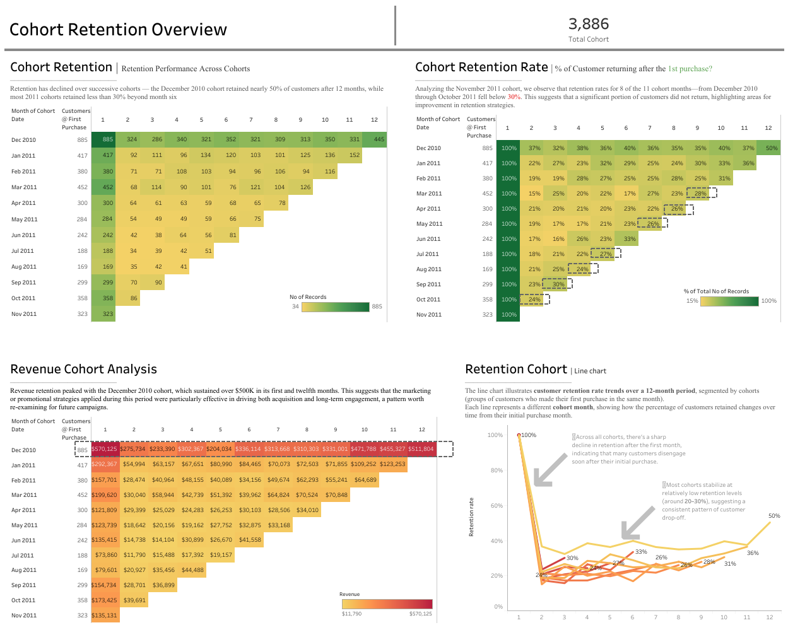

# Cohort Retention Analysis

---

## 📑 Executive Summary

This project analyzes customer behavior to solve a critical retention challenge. By combining **Time-Series Analysis (Cohorts)** with **Value-Based Segmentation (RFM)**, I diagnosed a sharp drop in customer retention after the first month. The analysis revealed that while 75% of new customers churn immediately, the business model is sustained by a highly resilient "VIP" segment that generates 90%+ of total revenue.

---

## 🏢 Business Problem
The business faced declining retention rates across 2011 cohorts compared to 2010 baselines. The goal was to answer two questions:
1. **When** are customers leaving? (Retention Timing)
2. **Who** are the customers leaving? (Quality of Acquisition)

---

## 🛠️ Solution Strategy
I employed a dual-layer analytical approach:
1. **Cohort Analysis:** To track retention rates of specific customer groups over a 12-month period.
2. **RFM Segmentation:** To classify customers based on Recency, Frequency, and Monetary value to distinguish between "high-value churn" vs. "low-value churn."
   
---

## 📌 Project Objectives

- Understand customer purchasing behavior over time (Cohort Analysis).
- Categorize your custommers based on their purchases behaviour (RFM Segmentation)
- Analyze retention rates across different customer cohorts.
- Visualize patterns and trends to support business decision-making.
- Build a **Cohort Retention | RFM Analysis Dashboard** for interactive insights.


---


## 🖼️ Dashboard Preview and insight 
#### A Tableau dashboard used to visualize performance and test scenarios can be found here →[Link to COHORT | RFM DASHBOARD](https://public.tableau.com/views/Cohort-RFMcombineddashboard/cohort-RFM?:language=en-US&:sid=&:redirect=auth&:display_count=n&:origin=viz_share_link)

### Cohort Retention Overview
- This dashboard visualizes the lifecycle of customer engagement, highlighting a significant challenge in retaining customers after their initial interaction. The "Cohort Retention Rate" heatmap reveals a sharp drop-off, where retention across most cohorts falls below 30% immediately after the first month, suggesting that a large portion of customers do not return for a second purchase. While the December 2010 cohort is a notable outlier—generating the highest revenue ($570k in month 1) and maintaining strong retention (50% by month 12)—subsequent cohorts from 2011 show weaker acquisition numbers and faster churn rates, indicating a potential decline in marketing efficiency or product stickiness over time.


* **Insight:** The December 2010 cohort was an outlier in performance (50% retention at Month 12). Subsequent cohorts (Jan 2011 - Oct 2011) show a significant dip in retention strength (<30% beyond Month 6), indicating a potential issue with recent acquisition channels or product market fit for newer users.

### RFM Segmentation Overview
- This analysis categorizes customers based on value and behavior, revealing a heavy reliance on a specific high-value group. The "Customer Segment Distribution" shows that while "Lost Customers" are the most numerous group (1,340), they contribute very little financial value ($339k); conversely, "VIP Customers" generate the vast majority of total revenue ($6.2M) despite being fewer in number. The "Customer Segment Metrics" further illustrate that VIPs have a significantly higher average frequency (9.7 purchases) and average lifespan compared to the "At Risk" and "Lost" segments, confirming that the business model is currently sustained by deep engagement with a core group of power users rather than broad-based retention.
  

* **Insight:** The "Lost Customer" segment is the largest by volume (1,340 users) but contributes the least revenue ($339k).
* **Value Driver:** The "VIP" segment, though smaller, generates **$6.2M** in revenue with an average of 9.7 purchases per user.

### Cohort | RFM Combined Insight Dashboard
- This dashboard merges the previous two analyses to explain why the retention rates drop so sharply. The "Segment Contribution to Overall Retention Rate" area chart demonstrates that the steep drop after month one is caused almost entirely by the "Lost Customers" segment churning immediately, acting as a natural filter where only high-value customers remain. The "Distribution of Customer Lifespan Days" box plot validates this model, showing that the "Lost Customers" have near-zero tenure, whereas the long-tail retention curve seen in the earlier dashboards is supported exclusively by the "VIP" and "Loyal" segments, who maintain significantly longer lifespans.


* **Insight:** Retention drops precipitously (approx. 75%) after the first month. However, the analysis proves this is a "natural filter." The customers dropping off are low-value, one-time purchasers.
* **Validation:** The retention curve stabilizes after Month 2, supported almost exclusively by VIP and Loyal Customer segments.

---

## 📈 Actionable Insights from Cohort | RFM Combined Insight Dashboard:
________________
### 1. Retention & Onboarding (Focus: Index 1 →2) 
The Insight (From Table & Area Chart): The most significant point of failure is the initial period. The total count of customers in the table drops drastically after Index 1, and the Retention Rate Area Chart shows a steep ≈ 75% loss of the initial cohort. This churn is heavily concentrated in the Lost Customers and At Risk categories. 


- Action 1: Overhaul Onboarding (Critical): Invest 80% of retention budget on the period immediately following the first purchase/activation. Implement a 7-day, 14-day, and 30-day outreach campaign specifically focused on driving the second transaction or achieving a core product milestone. 


- Action 2: Re-evaluate Lost Customer Definition: Since 1,340 customers are immediately classified as "Lost" in Index 1, review the Recency threshold for new customers to allow more time (e.g., 60 days instead of 30) before labelling them lost, giving marketing a chance to intervene. 


### 2. Segment Stability & Value Protection (Focus: Box Plot & Area Chart) 
The Insight (From Box Plot & Table): Customers who transition to VIP and Loyal Customers are the most resilient group, possessing significantly longer median lifespans (≈180 to 290 days). This group is the sole engine driving stable retention after Index 2. 


- Action 3: Implement Milestone Loyalty Program: Create an exclusive program for customers who reach Index 6 or Index 12. These customers are proven high-value and resilient. Offer unique perks or recognition to reinforce their loyalty and prevent even minor decay. 


- Action 4: Proactive 'At Risk' Intervention: The At Risk segment is defined by a low median lifespan, but those who survive are valuable (Box Plot wide spread). Create a targeted win-back campaign for At Risk customers who have a Lifespan greater than the median (20 days) but whose Recency score has dropped. These are established customers worth saving. 


### 3. Acquisition Quality & Seasonality (Focus: Stacked Bar Chart) 
The Insight (From Stacked Bar Chart): Acquisition quality varies significantly by month. The December 2010 cohort, while having the highest volume, also has a high proportion of lower-value segments. Conversely, you can identify months with the highest proportion of the desirable VIP/Loyal segments (the colors that dominate the top of the bars). 


- Action 5: Deconstruct High-Quality Cohorts: Identify the top 2-3 cohorts with the highest proportion of VIP and Loyal Customers (e.g., perhaps Jan or Feb 2011). Analyze the specific marketing channels, promotions, and product mix used during those months. Replicate those successful strategies in future acquisition efforts. 


- Action 6: Adjust Promotional Spend: If a high-volume month (like Dec 2010) delivered low-quality customers, reduce or restructure promotional spending during that time next year. Shift budget towards the months that historically generated the highest-quality customer mix.

---

## 🗂 Methodology / Code Snippet

### 1️⃣ Data Cleaning and Preparation

- The dataset was first cleaned using **SQL**:
    - Removed invalid records (null CustomerID, negative quantity/price).
    ```sql
    -- Filter out NULL CustomerIDs and add Revenue
    SELECT 
    InvoiceNo,
    StockCode,
    [Description],
    Quantity,
    InvoiceDate,
    UnitPrice,
    CustomerID,
    Country,
    (Quantity * UnitPrice) AS Revenue
    INTO #Filtered_Retail
    FROM Online_Retail
    WHERE CustomerID IS NOT NULL;
    ```
    ```sql
    -- Keep only valid transactions
    SELECT *
    INTO #Valid_Transactions
    FROM #Filtered_Retail
    WHERE Quantity > 0 AND UnitPrice > 0;
    ```
    - Remove duplicated transactions.
    ```sql
    SELECT *,
       ROW_NUMBER() OVER (PARTITION BY InvoiceNo, StockCode, Quantity ORDER BY InvoiceDate) AS row_num
    INTO #Duplicate_Transactions
    FROM #Valid_Transactions;
    ```
    ```sql
    SELECT  
    InvoiceNo,
    StockCode,
    [Description],
    Quantity,
    InvoiceDate,
    UnitPrice,
    CustomerID,
    Country,
    Revenue
    INTO Online_Retail_Main
    FROM #Duplicate_Transactions
    WHERE row_num = 1;
    ```
### 2️⃣ COHORT ANALYSIS

- Cohort Analysis
  ```sql
    -- =========================================
    -- 1: IDENTIFY CUSTOMER COHORTS
    -- =========================================
    SELECT 
        CustomerID,
        MIN(InvoiceDate) AS FirstPurchaseDate,
        DATEFROMPARTS(YEAR(MIN(InvoiceDate)), MONTH(MIN(InvoiceDate)), 1) AS CohortDate
    INTO #CustomerCohort
    FROM Online_Retail_Main 
    GROUP BY CustomerID;
    
    SELECT *
    FROM #CustomerCohort;
  ```
    ```sql
    -- =========================================
    -- 2: BUILD COHORT INDEX (MONTH DIFFERENCE)
    -- =========================================
    DROP TABLE IF EXISTS Cohort_Retention;
    
    SELECT 
        m.*,
        c.CohortDate,
        YEAR(m.InvoiceDate) AS Invoice_Year,
        MONTH(m.InvoiceDate) AS Invoice_Month,
        YEAR(c.CohortDate) AS Cohort_Year,
        MONTH(c.CohortDate) AS Cohort_Month,
        (YEAR(m.InvoiceDate) - YEAR(c.CohortDate)) * 12 +
        (MONTH(m.InvoiceDate) - MONTH(c.CohortDate)) + 1 AS Cohort_Index
    INTO Cohort_Retention
    FROM Online_Retail_Main m
    LEFT JOIN #CustomerCohort c 
        ON m.CustomerID = c.CustomerID
    WHERE NOT (YEAR(m.InvoiceDate) = 2011 AND MONTH(m.InvoiceDate) = 12);
    
    
    SELECT MAX(InvoiceDate)
    FROM Cohort_Retention;
    
    SELECT *
    FROM Cohort_Retention;
    ```
    ```sql
    -- =========================================
    -- 3: PIVOT COHORT DATA (RETENTION COUNT)
    -- =========================================
    SELECT *
    INTO #CohortCounts
    FROM (
        SELECT CohortDate, Cohort_Index, CustomerID
        FROM Cohort_Retention
        GROUP BY CohortDate, Cohort_Index, CustomerID
    ) base
    PIVOT (
        COUNT(CustomerID)
        FOR Cohort_Index IN ([1],[2],[3],[4],[5],[6],[7],[8],[9],[10],[11],[12])
    ) AS PivotedCohort;
    
    SELECT *
    FROM #CohortCounts
    ORDER BY CohortDate;
    ```
    ```sql
    -- =========================================
    -- 5: REVENUE ANALYSIS BY COHORT
    -- =========================================
    SELECT 
        CohortDate,
        Cohort_Index,
        SUM(Revenue) AS TotalRevenue,
        COUNT(DISTINCT CustomerID) AS Active_Customers
    FROM Cohort_Retention
    GROUP BY CohortDate, Cohort_Index
    ORDER BY CohortDate, Cohort_Index;
    ```
- Final Cohort dataset was exported [Cohort Retention](./Cohort_Retention.rar) for visualization.

### 3️⃣ RFM Segmentation
```sql
    DECLARE @analysis_date DATE;

    SELECT @analysis_date = MAX(InvoiceDate) 
    FROM Cohort_Retention;
    
    -- Drop existing table if re-running
    IF OBJECT_ID('dbo.RFM_Segments_Final','U') IS NOT NULL
        DROP TABLE dbo.RFM_Segments_Final;
    
    -- ============================================================
    -- Calculate base RFM metrics
    -- ============================================================
    WITH CustomerRFM AS (
        SELECT 
            CustomerID,
            DATEDIFF(DAY, MAX(InvoiceDate), @analysis_date) AS Recency,
            COUNT(DISTINCT InvoiceNo) AS Frequency,
            SUM(Revenue) AS Monetary,
            MIN(InvoiceDate) AS FirstPurchaseDate,
            MAX(InvoiceDate) AS LastPurchaseDate,
            DATEDIFF(DAY, MIN(InvoiceDate), MAX(InvoiceDate)) + 1 AS CustomerLifespanDays,
            COUNT(DISTINCT StockCode) AS UniqueProducts,
            SUM(Quantity) AS TotalQuantity,
            MIN(CohortDate) AS CohortDate,
            MIN(Cohort_Year) AS Cohort_Year,
            MIN(Cohort_Month) AS Cohort_Month       
        FROM Cohort_Retention
        WHERE CustomerID IS NOT NULL
          AND Quantity > 0
          AND Revenue > 0
        GROUP BY CustomerID
    ),
    
    -- ============================================================
    -- Calculate RFM quintile scores
    -- ============================================================
    RFM_Scores AS (
        SELECT 
            *,
            -- R: lower recency = better → invert score
            6 - NTILE(5) OVER (ORDER BY Recency ASC) AS R_Score,
            -- F: higher frequency = better
            NTILE(5) OVER (ORDER BY Frequency ASC) AS F_Score,
            -- M: higher spending = better
            NTILE(5) OVER (ORDER BY Monetary ASC) AS M_Score
        FROM CustomerRFM
    ),
    
    -- ============================================================
    -- Add derived metrics
    -- ============================================================
    RFM_Enhanced AS (
        SELECT 
            *,
            (R_Score + F_Score + M_Score) AS RFM_Score,
            CAST(R_Score AS VARCHAR(1)) + 
            CAST(F_Score AS VARCHAR(1)) + 
            CAST(M_Score AS VARCHAR(1)) AS RFM_Cell,
            CAST(Monetary / NULLIF(Frequency, 0) AS DECIMAL(12,2)) AS AvgOrderValue,
            CAST(Frequency * 1.0 / NULLIF(CustomerLifespanDays, 0) AS DECIMAL(12,6)) AS PurchaseFrequency,
            CASE WHEN Frequency > 1 
                 THEN CAST(CustomerLifespanDays * 1.0 / NULLIF(Frequency - 1, 0) AS DECIMAL(12,2)) 
                 ELSE NULL END AS AvgDaysBetweenOrders
        FROM RFM_Scores
    ),
    
    -- ============================================================
    -- Assign segments & actions
    -- ============================================================
    Customer_Segments AS (
        SELECT 
            *,
            CASE 
                WHEN M_Score >= 4 AND F_Score >= 4 AND R_Score >= 3 THEN 'VIP Customers'
                WHEN F_Score >= 3 AND M_Score >= 3 AND R_Score >= 3 THEN 'Loyal Customers'
                WHEN (R_Score >= 4 AND (F_Score >= 2 OR M_Score >= 3)) 
                     OR (M_Score >= 4 AND R_Score >= 3) THEN 'Potential Customers'
                WHEN (M_Score >= 3 OR F_Score >= 3) AND R_Score <= 2 THEN 'At Risk'
                ELSE 'Lost Customers'
            END AS Customer_Segment,
    FROM RFM_Enhanced
    )
    
    -- ============================================================
    -- Save to final table
    -- ============================================================
    SELECT * 
    INTO dbo.RFM_Segments_Final
    FROM Customer_Segments;
    
    SELECT *
    FROM RFM_Segments_Final;
```
```sql
    -- ============================================================
    -- SUMMARY STATISTICS BY SEGMENT
    -- ============================================================
    WITH SegmentStats AS (
        SELECT 
            Customer_Segment,
            Action_Priority,

        -- Base counts and revenue
        COUNT(*) AS CustomerCount,
        SUM(Monetary) AS TotalRevenue,
        AVG(Monetary) AS AvgRevenue,

        -- Behavior metrics
        AVG(Recency) AS AvgDaysSinceLastPurchase,
        AVG(Frequency) AS AvgOrders,
        AVG(AvgOrderValue) AS AvgOrderValue,

        -- RFM scores
        AVG(CAST(R_Score AS FLOAT)) AS AvgRecencyScore,
        AVG(CAST(F_Score AS FLOAT)) AS AvgFrequencyScore,
        AVG(CAST(M_Score AS FLOAT)) AS AvgMonetaryScore
    FROM RFM_Segments_Final
    GROUP BY Customer_Segment, Action_Priority
    )
    SELECT 
        Customer_Segment,
        Action_Priority,
        CustomerCount,
        CAST(CustomerCount * 100.0 / SUM(CustomerCount) OVER() AS DECIMAL(5,2)) AS CustomerPercent,
        TotalRevenue,
        CAST(TotalRevenue * 100.0 / SUM(TotalRevenue) OVER() AS DECIMAL(5,2)) AS RevenuePercent,
        AvgRevenue,
        AvgDaysSinceLastPurchase,
        AvgOrders,
        AvgOrderValue,
        AvgRecencyScore,
        AvgFrequencyScore,
        AvgMonetaryScore
    FROM SegmentStats
    ORDER BY Action_Priority, TotalRevenue DESC;
```
```sql
    -- ============================================================
    -- CUSTOMER SEGMENT DISTRIBUTION BY COHORT
    -- ============================================================
    SELECT 
        Cohort_Year,
        Cohort_Month,
        Customer_Segment,
        COUNT(*) AS Customers,
        AVG(Monetary) AS AvgRevenue,
        SUM(Monetary) AS TotalRevenue
    FROM RFM_Segments_Final
    GROUP BY Cohort_Year, Cohort_Month, Customer_Segment
    ORDER BY Cohort_Year, Cohort_Month, 
        CASE Customer_Segment
            WHEN 'VIP Customers' THEN 1
            WHEN 'Loyal Customers' THEN 2
            WHEN 'Potential Customers' THEN 3
            WHEN 'At Risk' THEN 4
            WHEN 'Lost Customers' THEN 5
        END;
```
  
- Final RFM dataset was exported to [RFM_Segment](./RFM_Segment.csv) for visualization.

---

# 📚 Project Files

- [Cohort_retention.sql](SQL_queries/cohort_retention.sql) → Cohort Retention Script
- [Customer_Segmentation.sql](SQL_queries/Customer_Segmentation.sql) → RFM Segmentation script 
- Tableau Dashboard → [Cohort | RFM_Dashboard](https://public.tableau.com/views/Cohort-RFMcombineddashboard/cohort-RFM?:language=en-US&:sid=&:redirect=auth&:display_count=n&:origin=viz_share_link)
  
---

## 🚀 Tools Used

- **SQL Server** (MS SQL) — Data cleaning & cohort table creation
- **Tableau** — Data visualization & dashboard creation
- **Excel** — Supporting analysis and data export/import

---

## 🤝 Acknowledgements

This project was completed as part of my Data Analysis portfolio, applying cohort analysis techniques using SQL and Tableau.

---

## 💬 Contact

For any questions or feedback, feel free to connect!

---

